# NativeDev

**Native Linux Development Environment Manager**

> Use what your system already provides.

NativeDev helps developers manage their local Linux development environment using the tools and services already provided by the operating system — no containers, no VMs, no bundled runtimes.

[](#license)
[](#supported-systems)
[](https://github.com/sayedsahin/nativedev/releases)

<p align="center">
  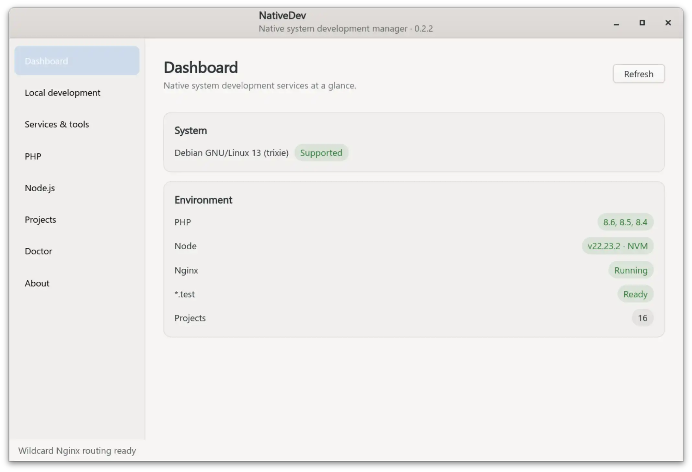
</p>

---

## Table of Contents

- [Why NativeDev](#why-nativedev)
- [Supported Systems](#supported-systems)
- [Features](#features)
- [Screenshots](#screenshots)
- [Architecture Overview](#architecture-overview)
- [Security](#security)
- [Installation](#installation)
- [Documentation](#documentation)
- [License](#license)

---

## Why NativeDev

NativeDev works *with* your Linux system instead of replacing it. PHP, Nginx, databases, Redis, Node.js, Composer, systemd, and other components remain native system resources — NativeDev simply gives you a graphical layer to manage them.

| | |
|---|---|
| 🚀 | No always-running development daemon or container stack |
| 📦 | No containers, no virtual machines, no bundled runtimes |
| 🔄 | Your system continues managing updates and security patches |
| 🐳 | Works alongside Docker, Podman, and other container workflows |
| 🛠️ | Uses native Linux tools and services already available on your system |
| 🖥️ | Manage your development environment without remembering CLI commands |
| 🔒 | Your environment remains transparent, predictable, and easy to debug |

---

## Supported Systems

NativeDev currently supports **Debian and Ubuntu based Linux distributions**.

> Support for additional distributions is planned for future releases.

---

## Features

| Feature | Description |
|---|---|
| 🌐 **Local Development** | Park projects with HTTP at `project.test`, optional HTTPS at `project.secure.test`, native Nginx wildcard routing, and automatic framework web root detection |
| 🐘 **PHP** | Manage PHP versions, extensions, and runtime settings |
| 🟢 **Node.js** | Manage Node.js versions and development environments |
| ⚙️ **Services & Tools** | Control Nginx, MariaDB, PostgreSQL, Redis, Memcached, RabbitMQ, Composer, mkcert, and more |
| 📁 **Projects** | Manage detected projects, choose PHP per project, and open the HTTP or HTTPS local URL directly |
| 🗄️ **Database Management** | Manage local database services and developer database access |
| 🔍 **System Doctor** | Check system requirements and detect configuration issues |
| 🔐 **Safe Privilege Management** | Perform system operations through a controlled privilege boundary |
| 🧩 **Native System Integration** | Works with distro packages, systemd services, filesystem permissions, and Linux conventions |

**Supported services & tools:** Nginx · MariaDB · PostgreSQL · Redis · Memcached · RabbitMQ · Composer · mkcert · phpMyAdmin · Adminer · Mailpit

### Local site URLs

NativeDev keeps ordinary local development on HTTP and makes HTTPS optional:

```text
HTTP   → http://example.test
HTTPS  → https://example.secure.test
```

The **Projects** page exposes both destinations with **Open HTTP** and **Open HTTPS**. HTTPS uses one mkcert wildcard certificate (`*.secure.test` with the default TLD), so adding a new project does not require a new certificate.

---

## Screenshots

### Local Development
Manage local projects, routing, domains, and development environment settings.

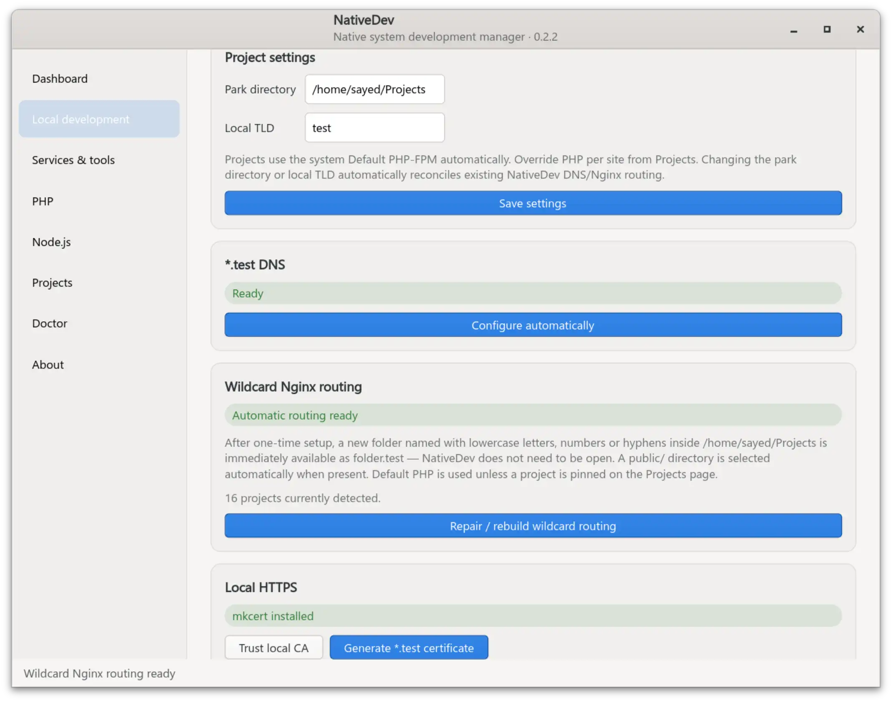

### Services & Tools

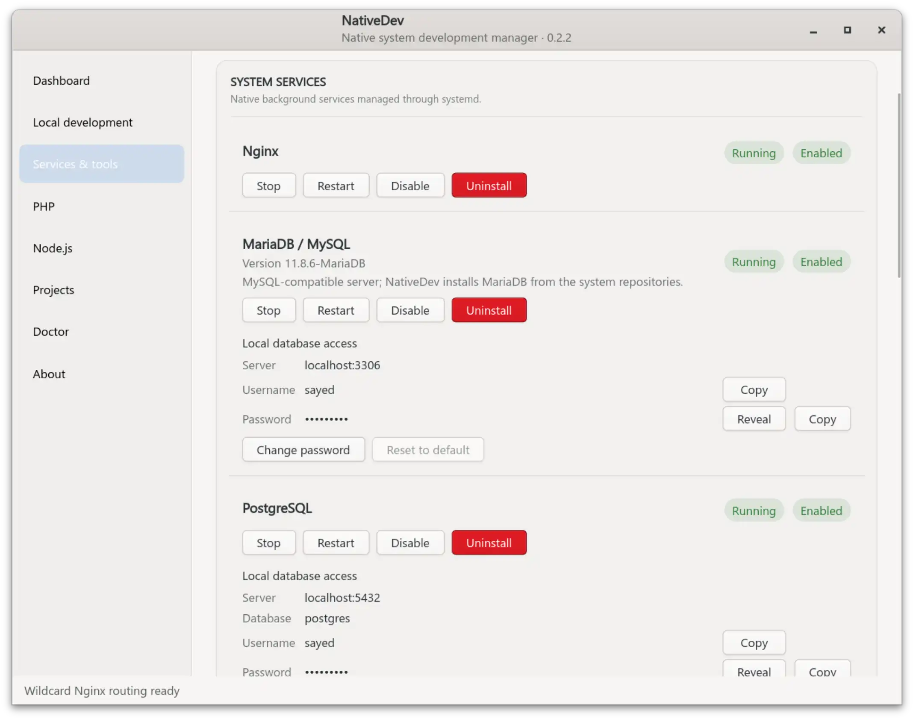
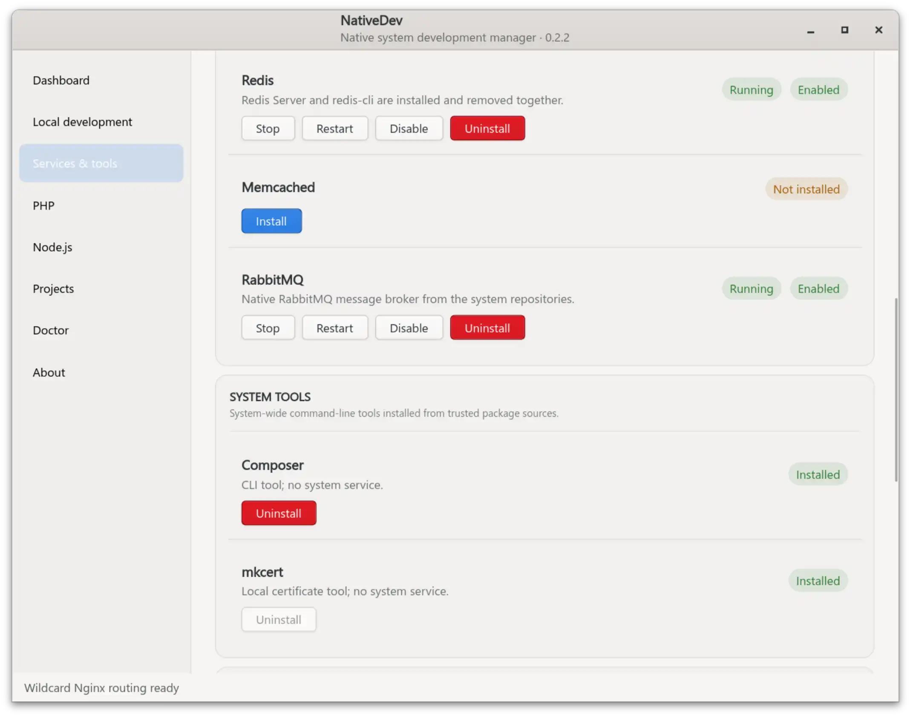
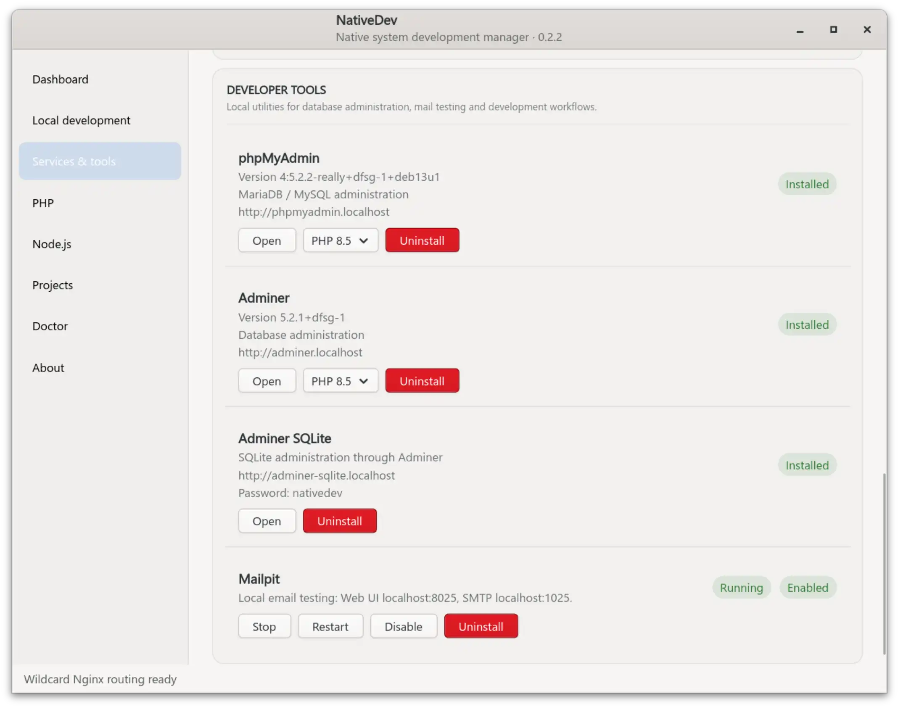

### PHP Management

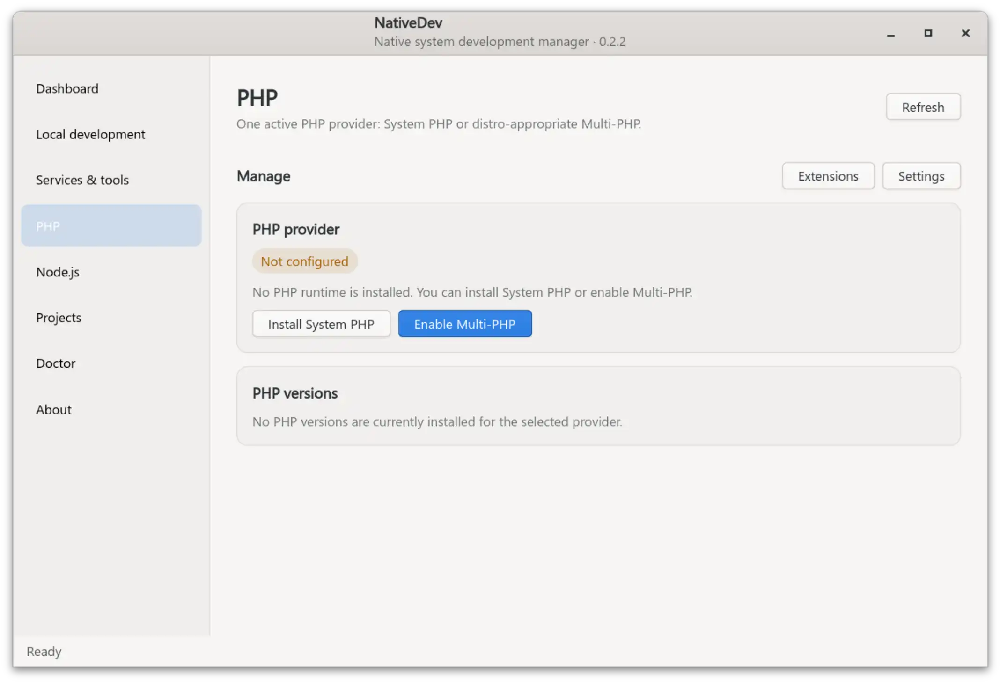
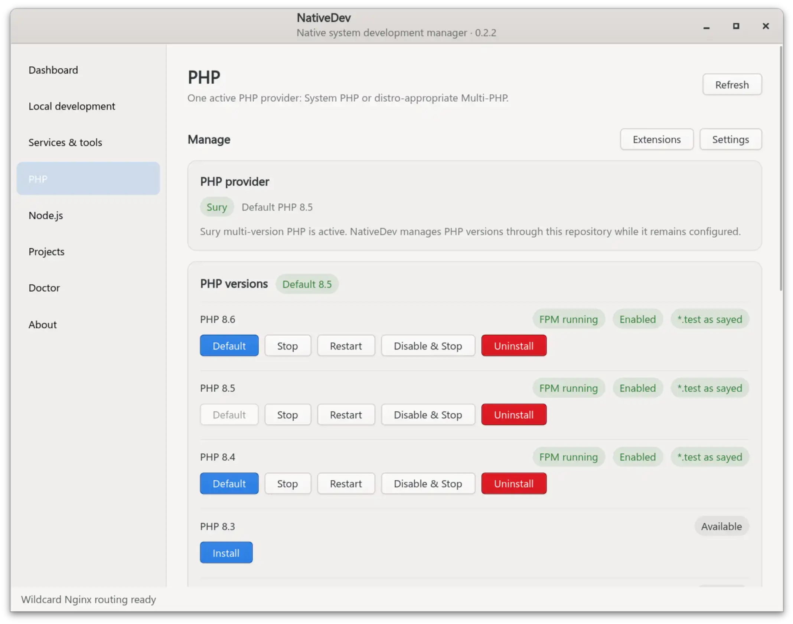
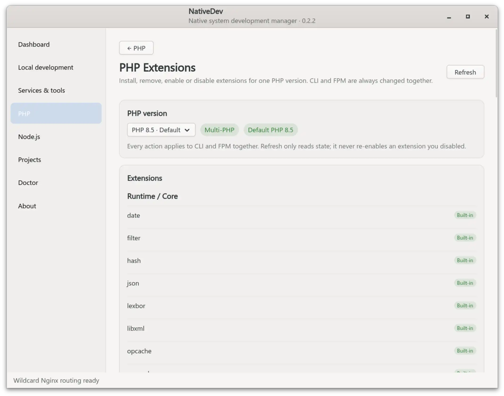
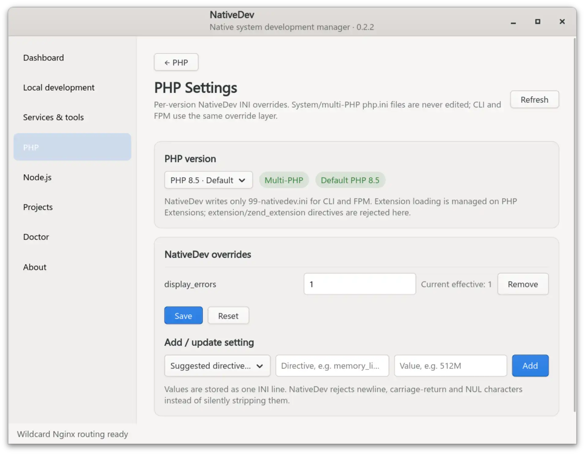

NativeDev supports both system PHP and multi-version PHP workflows:

- Detect existing system PHP
- Enable multi-PHP workflows
- Manage PHP-FPM versions
- Install and manage extensions
- Manage PHP settings
- Keep NativeDev configuration separate from distro configuration

### Node.js Management
Manage system Node.js or multi-version Node environments.

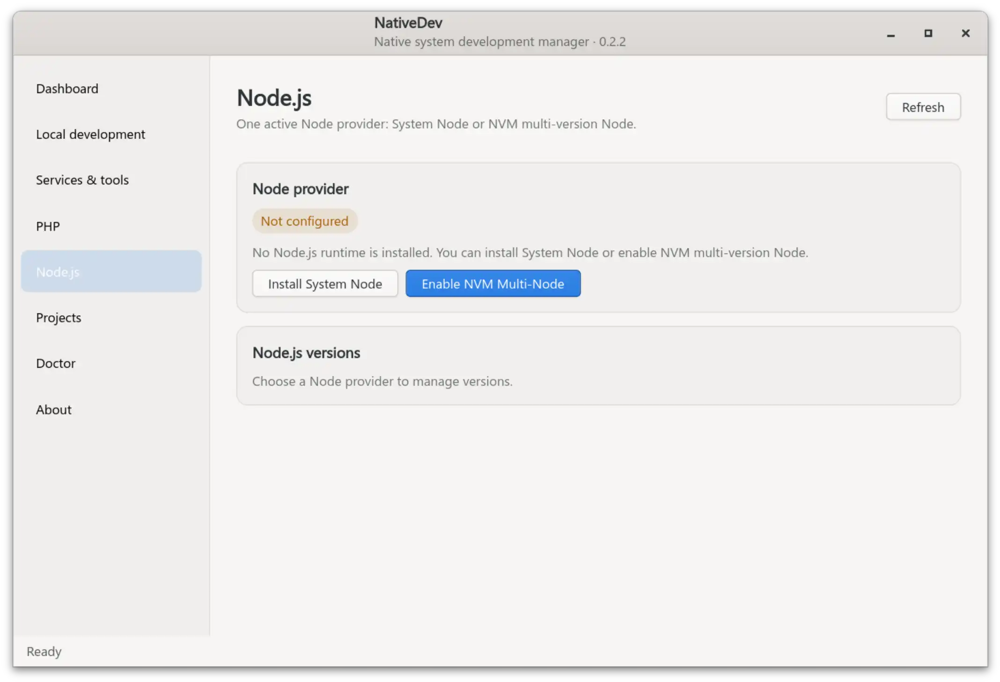
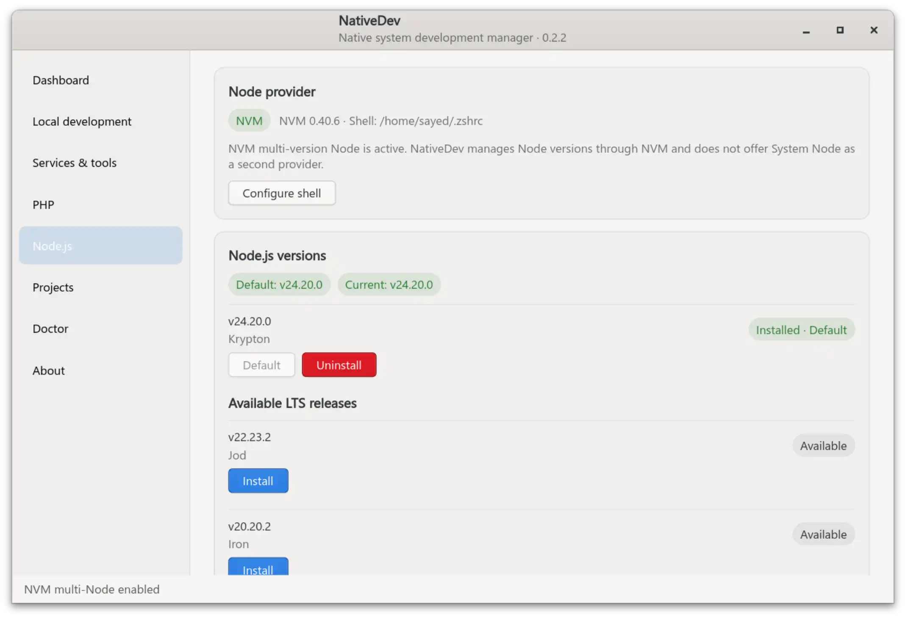

### Projects
Manage local development projects through a simple graphical interface.

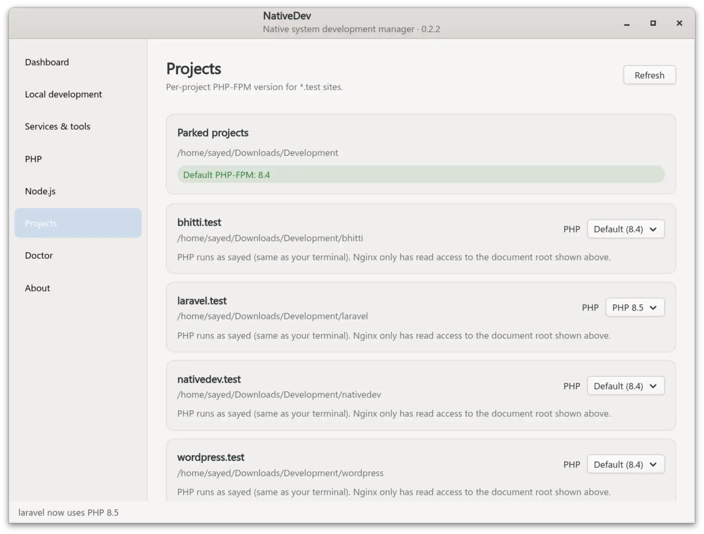

---

## Architecture Overview

```text
NativeDev Application
        │
NativeDev Controller
        │
Management Components
        │
System Integration Layer
        │
Privilege Helper
        │
Linux System Resources
```

📖 Detailed documentation:

- [Why NativeDev](https://sayedsahin.github.io/nativedev-doc/why-nativedev)
- [Architecture](https://sayedsahin.github.io/nativedev-doc/architecture)
- [Security Model](https://sayedsahin.github.io/nativedev-doc/security)
- [Local Development](https://sayedsahin.github.io/nativedev-doc/features/local-development)

---

## Security

NativeDev follows a strict privilege boundary:

- GUI runs as the normal user
- Root operations go through a restricted privilege helper
- The helper accepts structured actions instead of arbitrary commands
- Privilege protocol versions are validated before execution

---

## Installation

### Install from Release

Download the latest `.deb` package from [GitHub Releases](https://github.com/sayedsahin/nativedev/releases):

```bash
sudo apt install ./nativedev_<version>_all.deb
```

### Run from Source

For contributors and development:

```bash
./install.sh
```

See the [documentation](https://sayedsahin.github.io/nativedev-doc/) and [contributing guide](https://sayedsahin.github.io/nativedev-doc/contributing) for details.

---

## Documentation

- [Documentation home](https://sayedsahin.github.io/nativedev-doc/)
- [Why NativeDev](https://sayedsahin.github.io/nativedev-doc/why-nativedev)
- [Local Development](https://sayedsahin.github.io/nativedev-doc/features/local-development)
- [Architecture](https://sayedsahin.github.io/nativedev-doc/architecture)
- [Security Model](https://sayedsahin.github.io/nativedev-doc/security)
- [Troubleshooting](https://sayedsahin.github.io/nativedev-doc/troubleshooting)

---

## License

Released under the [MIT License](LICENSE).
